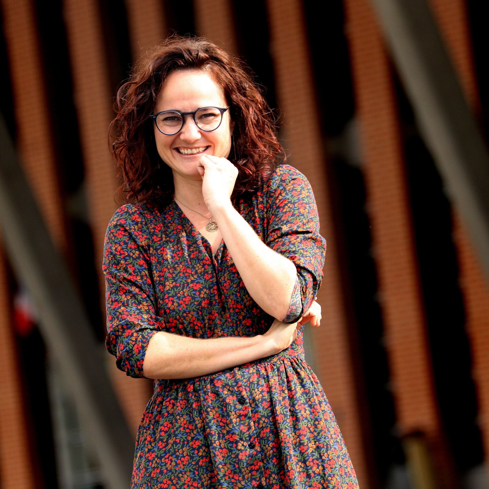

::: {.hero}

{.profile-photo}
<!-- PLACEHOLDER: replace profile.jpg with your own photo, square, at least 400x400px -->

# Eva Petitdemange

### Associate Professor, Centre Génie Industriel (CGI)

### [IMT Mines Albi](https://www.imt-mines-albi.fr/) <!-- confirm/replace link -->

:::

## Biography

I am a researcher and teacher at the IMT Mines Albi engineering school, in the Industrial Engineering Center (CGI).

I am interested in the theory, methods, and tools for improving the performance of socio-technical organizations, trying to develop the right methodology to better understand and solve organizational problems. I have worked in healthcare system fields, and I'm now working on logistics and transport problems. I use several types of simulation modeling techniques (discrete event, agent-based), trying to contribute to the digital twins of organizations, and I'm interested in the Physical Internet paradigm applied to Supply Chain.

I hold a PhD in Industrial Engineering and Informatics. My thesis, defended in November 2020, focused on a tool-based methodology to diagnose and improve the performance of emergency call centers. It was co-supervised by Matthieu Lauras (IMT Mines Albi), Franck Fontanili, and Elyes Lamine.

<!-- PLACEHOLDER: your HAL page has a "Voir plus" (see more) that I could not expand from here. If there's more biography text behind it (education before the PhD, earlier positions), paste it and I'll add it. -->

## Research interests

<!-- Drawn from your HAL keyword list (frequency in your publications). Reordered, not filtered, confirm before publishing. -->

- Physical Internet
- Federated interoperability
- Mobilité rurale / rural mobility, hyperconnected transport
- Simulation (discrete event, agent-based, digital twins)
- Demand estimation
- Multi-agent systems
- Decision-support tools

## News

<!-- Optional section, common on academic sites. Suggested entries below are drawn from what you've told me about recent work; confirm dates and wording before publishing, since I'm not certain of exact phrasing or dates. -->

- **[À VALIDER, date]** IPIC26 Pre-Conference (Albi) — Doctoral Colloquium, six finalists selected for the Bordeaux plenary.
- **[À VALIDER, date]** New PhD recruitment underway: heterogeneous AGV/AMR fleet management for resilient intralogistics (FORCE/Airbus, co-supervised with Prof. Jacques Lamothe).
